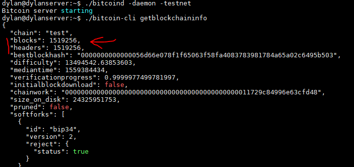
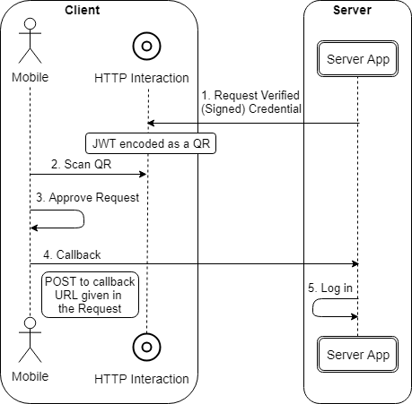

# Blockchain-based payment system
## Pending Functions/Problems
1. Not yet have function which lets user deposit BTC from external wallet to account. //Apply node-cron module to be able to update periodically
2. Not yet have function letting users to open channel with external lightning nodes (non-merchant) themselves. 
3. Not yet handle process in which external lightning node (non-merchant) transfer to internal users who don't have their own node. //Apply node-cron module to be able to update periodically
4. Not having "forgot password" function.
5. Modify Login process to be user-friendly. (Auto redirect to homepage when logged in successfully).


## Install
### Required Environment
- Node v8.10.0
- Bitcoin-core **v0.17.1**
- Eclair **v0.2-beta9**
- Uport Mobile App (IOS/Android)

### Install dependency packages
Cd into repository dir, then cmd:
    ``` npm i ```

### Install no-GUI Bitcoin-core v0.17.1 (Bitcoind)
Source: https://bitcoin.org/en/release/v0.17.1

Bitcoind methods & guides: https://en.bitcoin.it/wiki/Running_Bitcoin

*Note: These steps below applying to GUI-less (no GUI) Bitcoin-core also called as Bitcoind on Ubuntu OS at home ~ dir*
1. Download [bitcoin-0.17.1.tar.gz](https://bitcoincore.org/bin/bitcoin-core-0.17.1/bitcoin-0.17.1.tar.gz) to **home** dir **~** and unzip it, then you'll get folder **bitcoin-0.17.1**.
2. Build Bitcoind (Bitcoin-core without GUI) from source code with tutorial files from **bitcoin-0.17.1/doc**.
3. After successfully compiling Bitcoind, create and edit the **~/.bitcoin/testnet3/bitcoin.conf** file:
    ```
    rpcuser=[custom-username]
    rpcpassword=[custom-password]
    testnet=1
    server=1
    txindex=1
    zmqpubrawblock=tcp://127.0.0.1:29000
    zmqpubrawtx=tcp://127.0.0.1:29000
    addresstype=p2sh-segwit
    deprecatedrpc=signrawtransaction
    deprecatedrpc=accounts
    port=18332
    ```
4. Copy 2 files: **bitcoin-0.17.1/src/bitcoin-cli** and **bitcoin-0.17.1/src/bitcoind** to **home** **~** dir.
5. Start Bitcoind as daemon process on testnet by execute copied file:

    ```~/./bitcoind -daemon -testnet```

6. Execute **bitcoin-cli** to get blockchain info:

    ```~/./bitcoin-cli getblockchaininfo```
    
7. When initialize the Bitcoind for the first time, it has to download a full testnet blockchain. This process can take up to half a day based on Internet connection. Finish when **blocks** equals to **headers**:



### Running no-GUI Eclair v0.2-beta9
Source: https://github.com/ACINQ/eclair

*Note: You can start Eclair only if Bitcoind is running and has finished downloading full testnet blockchain. These steps below applying to GUI-less (no-GUI) Eclair on Ubuntu OS at home ~ dir*

1. Download [eclair-node-0.2-beta9-eb0e45a.jar](https://github.com/ACINQ/eclair/releases/download/v0.2-beta9/eclair-node-0.2-beta9-eb0e45a.jar) to **home** dir **~**.
2. Create and edit the **~/servernode/eclair.conf** file:
    ```
    eclair.node-alias="[custom-server-alias]"
    eclair.api.enabled=true
    eclair.api.password="[custom-eclair-node-password]"
    eclair.chain=testnet
    eclair.server.port=48001 //1 node 1 port
    eclair.bitcoind.rpcport=18332
    eclair.bitcoind.rpcuser="[bitcoind-username]"
    eclair.bitcoind.rpcpassword="[bitcoind-password]"
    eclair.api.binding-ip="0.0.0.0" //Binding eclair api to localhost
    eclair.api.port=8080 //1 node 1 port
    ```
3. Start Eclair process:

    ```java -Declair.datadir=servernode -jar eclair-node-0.2-beta9-eb0e45a.jar```


4. Download [eclair-cli](./file/eclair-cli) to **home** dir **~**.
5. Execute **eclair-cli** to get node info:

    ```~/./eclair-cli -p [eclair-node-password] -a localhost:[node-api-port] getinfo```


6. Repeat step 2 and 3 to create more nodes with different folder names, **server port**, **api port** and remember to change **-Declair.datadir=[folder_name]** to start those new nodes!

*[Optional] You can assign eclair-password and eclair-api-port in **eclair-cli** file for easy command line usage.*

## Start server
``` npm start ```

Above command will start a server with host is random ngrok-URL at port 3000 and log that link to console.

To config server, you can edit file **bin/www**.

## App Models

### Signup Function


### Login Function


### Internal Transfer Function


### JSON Database Structure


## How to use?

### Provided Users
1. User1:

    ID: luonganhtuan
    
    Pass: Payment123!
    
2. User2:

    ID: daidepzai113
    
    Pass: Payment123!

### Signup
Signup page: [App_Link/signup](./Payment_Web_App/routes/signup.js)

### Login
1. With User1: [App_Link/home1](./Payment_Web_App/routes/home1.js)
2. With User2: [App_Link/home2](./Payment_Web_App/routes/home2.js)
3. With your created user: [App_Link/login](./Payment_Web_App/routes/login.js)

### External Transfer
*Only available after logging in successfully*

External Transfer page: [App_Link/btc/lntransfer](./Payment_Web_App/routes/btc/lntransfer.js)

**Requirement:**
- Bitcoind and Eclair-Servernode are running.
- Already established channel with Node that created in-use Lightning request.

### Internal Transfer
*Only available after logging in successfully*

External Transfer page: [App_Link/btc/lnintransfer](./Payment_Web_App/routes/btc/lnintransfer.js)

**Requirement:**
- Bitcoind and Eclair-Servernode are running.

### Decode Lightning Request
*Only available after logging in successfully*

Decode Lightning Request page: [App_Link/btc/lndecode](./Payment_Web_App/routes/btc/lndecode.js)

**Requirement:**
- Bitcoind and Eclair-Servernode are running.

### Create Lightning Request
*Only available after logging in successfully*

Create Lightning Request page: [App_Link/btc/lnreceive](./Payment_Web_App/routes/btc/lnreceive.js)

**Requirement:**
- Bitcoind and Eclair-Servernode are running.

### Withdraw
*Only available after logging in successfully*

Withdraw page: [App_Link/btc/lnwithdraw](./Payment_Web_App/routes/btc/lnwithdraw.js)

**Requirement:**
- Bitcoind is running.

